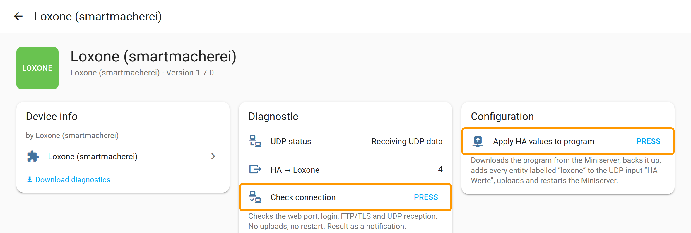
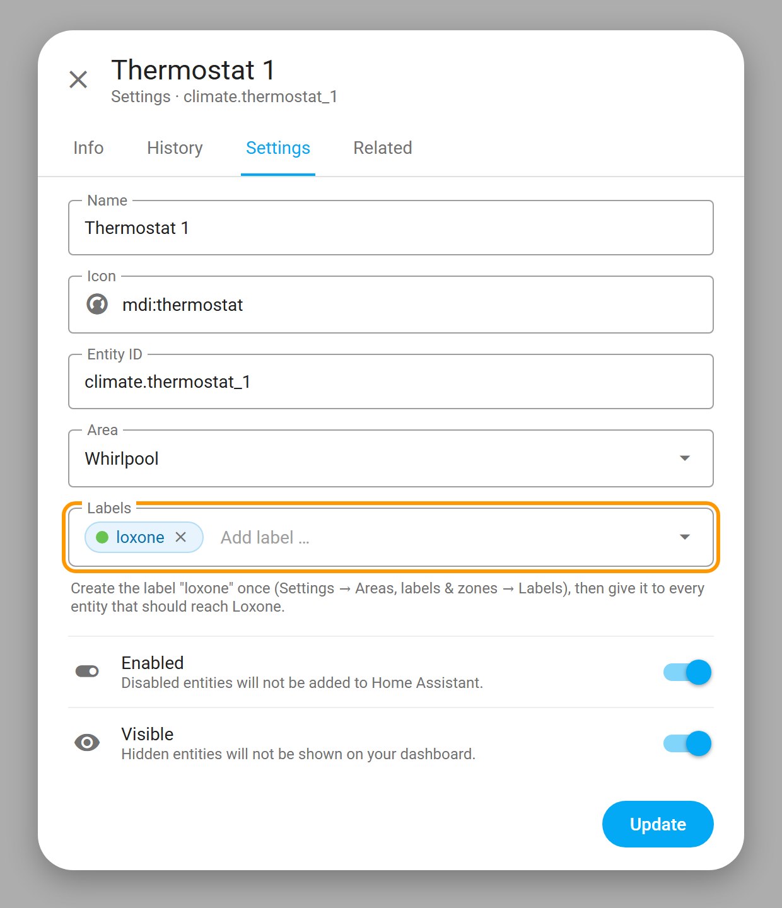
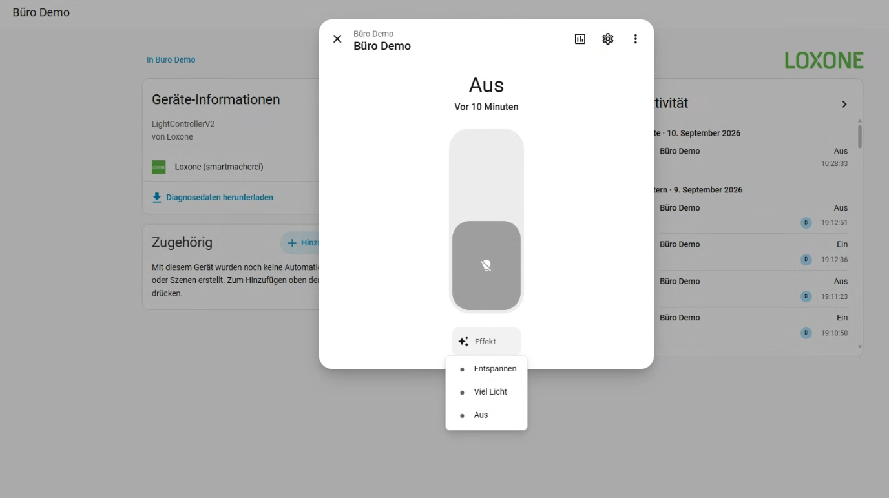

# Loxone for Home Assistant — smartmacherei

[Deutsch](README.de.md) · [Changelog](CHANGELOG.md) · [Support](https://github.com/smartmacherei/Loxone-Integration/issues) · [smartmacherei.at](https://smartmacherei.at/)

**Real-time updates in Home Assistant, without adding extra controls to your Loxone visualization.**

Bring supported Loxone devices and signals into Home Assistant, grouped by physical
device. Eligible inputs and outputs can be discovered without enabling each one in
the Loxone visualization. Your existing visualization stays focused on what you use.

Based on [PyLoxone](https://github.com/JoDehli/PyLoxone), with additional device discovery
and automatic setup by smartmacherei.

[See 20 devices in Home Assistant](docs/screenshots/1.3.3/README.md) — original
German and English screenshots from the demo installation.

## What you get

- **More signals, less configuration.** Discover supported physical inputs and outputs
  without adding visualization controls just to use them in Home Assistant.
- **Devices that belong together.** Group physical channels under their actual device
  where the Miniserver program provides the required topology.
- **Real-time updates for eligible signals.** Receive changes directly, including
  supported signals outside the visualization.
- **A verified project backup before changes.** Keep the complete original program
  and a project file that can be opened in Loxone Config.

**Current release: 1.7.2.** Project backup, automatic upload/restart, UDP heartbeat reception and
integration reload were verified on the demo installation; UDP setup in a Gateway/Client
system was verified on a four-Miniserver installation. Physical device transitions and
restoration from backup still require acceptance testing. Gateway/Client installations:
all Miniservers are discovered and read; automatic UDP setup for them leaves the programs
unchanged unless the option "Set up UDP in a Gateway/Client system too" is enabled (see
below). Way 3 (HA → Loxone) is new in 1.7.0 and not yet verified on real hardware.

## Install with HACS

1. In HACS, open **Custom repositories** from the menu.
2. Add `https://github.com/smartmacherei/Loxone-Integration` as an **Integration**.
3. Download **Loxone** and restart Home Assistant.
4. Open **Settings → Devices & services → Add integration → Loxone**.
5. Enter the Miniserver address, HTTP port, username and password. The form defaults
   to `80`. If your Miniserver uses another HTTP port, enter that port explicitly.
6. Below the connection data the form shows two ways. **Way 1 (HA → Loxone)** is always
   active: Home Assistant reads controls and terminals from the Miniserver; its options
   only decide what gets created. **Way 2 (Loxone → HA)** is optional: the Miniserver
   pushes real-time values over UDP. It changes the Miniserver program, see the
   [disclaimer](#disclaimer) before enabling it.

HACS offers the published GitHub releases for this custom repository.
This fork uses the same `loxone` domain as PyLoxone. Install only one of them.
Use a non-default Miniserver password and an account allowed to read the program.
Home Assistant must be able to reach the Miniserver on the local network.

## Using it in Home Assistant

The integration's device card lives under **Settings → Devices & services → Loxone → device
"Loxone (smartmacherei)"**. All three ways are visible there (rendering of the card in
version 1.7.0):

| Element | What it does |
|---|---|
| **UDP status** | Way 2. Shows whether real-time values arrive from the Miniserver ("Receiving UDP data"). The setup itself is enabled under *Configure*. |
| **HA → Loxone** | Way 3. Number of values that exist as inputs in the Loxone program. The attributes `pending_add` and `pending_remove` show what a button press would change. |
| **Check connection** | Checks the web port, login, FTP/TLS and UDP reception. No uploads, no restart. The result arrives as a notification. Press it first whenever something looks wrong. |
| **Apply HA values to program** | Way 3. Writes every entity labelled "loxone" into the Miniserver program (backup, upload, restart). Nothing changes without the button. |

Getting a value from Home Assistant into Loxone:

1. Give the entity (say, the thermostat) the label **loxone** in HA: Settings → Devices &
   services → Entities → open the entity → gear → Labels. Create the label once (Settings →
   Areas, labels & zones → Labels); it is then offered in every entity.

   

2. On the device card, "HA → Loxone" lists the new values in its `pending_add` attribute.
3. Press **Apply HA values to program**. The Miniserver restarts briefly.
4. In Loxone Config, load the project **from the Miniserver**. Under Periphery → Virtual inputs
   you now find "HA Werte" with one command per value, e.g. "Thermostat 1 current temperature".
   Drag the commands onto your pages as usual.
5. From now on HA sends every change at once, plus all values every 5 minutes.

Another button press appends new entities and removes deselected ones; existing commands stay
as they are, even after you renamed or changed them in Config.

The value rules are described under [HA → Loxone (way 3)](#ha--loxone-way-3-label-and-button).

## Automatic real-time setup (UDP)

For new installations, the setup form offers automatic real-time configuration for
eligible discovered terminals. Existing installations keep their current behavior
until you explicitly enable the option.

One limit applies to every way (default 500, adjustable at the top of the form): this many
additionally discovered terminals become entities, are polled and get UDP loggers; later it
also bounds signals from Home Assistant into Loxone. Polling itself is capped at 200 requests
per 30 seconds and two concurrent requests per Miniserver, so a very large installation, for
example a Gateway/Client system with many Miniservers, is polled in rotation instead of
flooding the Miniservers or the network. Entities you disable in Home Assistant are not
polled at all, and device internals (online state, protective shutdowns, internal
temperature, raw formats) are created disabled, so the Miniserver only answers for what
you actually use. Once configured, the integration
only reads the Miniserver's program directory listing every 60 seconds; the program
itself is downloaded again only after Loxone Config saved a new one.

**Automatic setup changes the Miniserver program and briefly restarts its logic.**
It needs permission to upload and activate the program. Before any change, the
integration saves and verifies the complete original archive and an openable
`.Loxone` project. **If the backup fails, no upload or restart takes place.**

The integration also checks replacement programs and can configure real-time updates
again when needed. This may cause another backup and brief restart. Avoid simultaneous
saves from Loxone Config while setup is running. Load the current program
**from the Miniserver** before editing it.

See [setup requirements, technical details and recovery](docs/automatic-udp.md)
for the full procedure and the exact settings.

## HA → Loxone (way 3, label and button)

Values from Home Assistant (thermostat readings, sensors, switches) can become inputs in
the Loxone program without creating objects in Loxone Config:

1. Give every entity that should reach Loxone the label **loxone** in Home Assistant.
2. The diagnostic sensor **HA → Loxone** shows how many values are in the program and, as
   attributes, `pending_add` / `pending_remove` (entities that gained or lost the label
   since the last button press), `unsupported` (text states) and `beyond_limit`.
3. Press **Apply HA values to program**. The integration downloads the current program from
   the Miniserver, backs it up, adds one virtual UDP input "HA Werte" (port 55556) with
   one command per value under the gateway's (or only Miniserver's) virtual inputs,
   uploads and restarts. Nothing changes without the button, even when labels change.
4. From then on every state change is sent as `<key>=<number>`, plus all values every
   5 minutes and after each program change. In Loxone Config, load the project from the
   Miniserver and drag the commands from the periphery onto your pages; clients reach
   them like any gateway input.

Values are numbers only: numeric states as they are; on/off, open/closed and similar as
1/0; entities with an `options` attribute as the index of the state; `climate` entities
give the mode index (`hvac_modes`), current temperature, target temperature and the
action index (off, heating, cooling, drying, idle, fan, preheating, defrosting). Text
states are listed as unsupported. Way 3 needs way 2 (automatic UDP setup) enabled,
because it uses the same backup, upload and restart chain. `udp_max_signals` caps the
number of values.

## Scope and limitations

See [device coverage and the acceptance checklist](docs/device-coverage.md) for
native controls, read-only states, special formats and the tested project coverage.

- Real-time support applies to eligible signals, not every terminal. Unwired outputs
  and unsupported value formats may still update at 30-second intervals.
- Existing visualization controls continue to use their established live connection.
  No additional visualization entries are needed for supported discovered terminals.
- Automatic editing currently supports the tested Loxone Config 17.1/17.2 program
  formats. Unsupported formats are left unchanged.
- Physical output switches write directly to terminals. Review their use if the
  Loxone program also controls those outputs; disable unwanted entities or discovery.
- The integration does not automatically discover a changed Miniserver IP address.
  Use a stable address or update the host option.
- Gateway/Client installations: discovery reads the full project, so terminals of all
  Miniservers are found and grouped by their Miniserver; terminals of a client are polled
  at that client. Automatic UDP setup stops before any change with the error code
  `ARCHIVE_MULTIPLE_PROGRAMS` unless the option is enabled. WebSocket, commands and
  rooms work through the gateway as usual.
- Gateway/Client (1.7.0): with the option "Set up UDP in a Gateway/Client system too", every
  Miniserver gets its own logger and page "HA UDP" in its own program, limited to 5
  terminals per Miniserver, plus a heartbeat per Miniserver. Battery levels and device
  internals never take a slot; they are read over HTTP every 4 hours instead.
  The full project and every partial program are changed consistently; the archive is
  uploaded to the gateway only, which distributes the partial programs to the clients
  after the restart. Program format 174 (Config 16.x) is accepted on this path only.
  Verified on a four-Miniserver installation with 1.7.0b2; still check the backup and
  use at your own risk.
- Way 3 (HA → Loxone, 1.7.0): numbers only, one virtual UDP input "HA Werte" on port 55556
  in the gateway (or only) Miniserver, at most `udp_max_signals` values, and only with way 2
  enabled. Text states are not exported. The program changes only on the button press, and
  Loxone Config must load the project from the Miniserver afterwards. Not yet verified on
  real hardware.
- Battery levels and device internals are read every 4 hours over HTTP and never take a
  UDP slot. On installations set up before 1.7.0 the battery logger references disappear
  at the next save from Loxone Config (one upload, one restart).
- Door, window, opening and garage contacts follow the Loxone status texts: if value 1 is
  labelled "Geschlossen"/"closed"/"zu", HA shows the entity closed at 1. Without such texts
  the raw polarity applies.
- State updates reach the entities through an internal dispatcher. The former bus
  event `loxone_event` is no longer fired, which keeps the recorder database small.
  Automations should use entity states; `loxone_send` for commands is unchanged.
- Lighting moods are available as effects of the light entity (below: a lighting
  controller from the demo installation with its moods). Generated scene entities were
  removed in 1.5.0; their registry entries are cleaned up automatically.

  

Installing updated integration code requires restarting Home Assistant.

After deleting devices in Loxone Config, save the program to the Miniserver and
reload the Loxone integration in HA. Deleted UUIDs are reconciled against the
verified full project; offline devices remain. Automatic setup checks program
changes every 60 seconds when enabled and reloads after successful configuration.
If automatic setup is disabled or blocked, reload manually. Registry records are
backed up under `/config/loxone_registry_backups/<entry-id>/` before removal.
Cleanup is skipped if the project cannot be verified. Custom entity identifiers
that cannot be matched safely may still need manual review.

## Backups and support

On a standard HA installation, project backups are stored under
`/config/loxone_backups/<server-id>/`. They survive removing and reinstalling the
integration. Copy them to a separate computer for recovery if the HA server or its
storage fails. [Restore your original project](docs/automatic-udp.md#restore-the-original-project).

If setup fails, check the HA notification and integration diagnostics. The diagnostic
status distinguishes setup progress from actual reception of live data. Quiet inputs
may not send updates until their value changes.

For support, include integration, HA and Miniserver versions and the observed error.
**Do not attach project backups or credentials to public issues.**

## Disclaimer

This integration is an independent project by [smartmacherei e.U.](https://smartmacherei.at/) It is not affiliated
with, endorsed by or supported by Loxone Electronics GmbH. "Loxone" and "Miniserver"
are trademarks of their respective owners.

**Automatic real-time setup (Way 2) downloads the Miniserver program, adds a page with
logger objects, uploads the changed program and restarts the Miniserver logic.** The
integration saves and verifies a complete backup first and stops whenever a check fails.
You nevertheless use this feature at your own risk. The software is provided "as is"
without warranty of any kind, as stated in the Apache License 2.0. To the extent
permitted by law, smartmacherei e.U. and the contributors accept no liability for damage
of any kind resulting from the use of this integration, including but not limited to
loss or corruption of Miniserver programs, malfunction or downtime of building services
(heating, lighting, shading, access control, alarm systems), data loss, or the cost of
restoring a project. Before enabling automatic setup, keep your own current project
backup in Loxone Config, review the changed program afterwards, and enable it only on
installations you are authorised to change.

## License

Apache License 2.0: [LICENSE](LICENSE) and [NOTICE](NOTICE).
Based on PyLoxone by JoDehli and contributors, with modifications by smartmacherei.

## Room mapping / Raumzuordnung

[Optional room mapping during setup and in integration options / Optionale Raumzuordnung](docs/room-mapping.md).
[UDP setup diagnostics / UDP-Einrichtungsdiagnose](docs/udp-setup-diagnostics.md).

[Connection checks and diagnostic downloads / Verbindungspruefung und Diagnosedaten](docs/connection-diagnostics.md).
